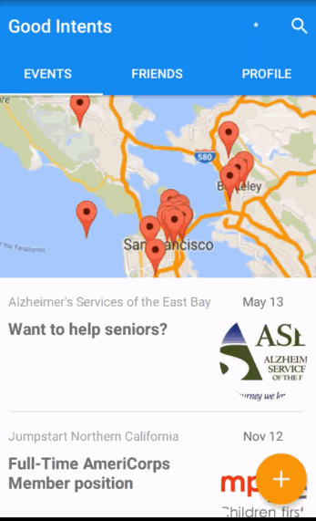

# Good Intent

Description
----
Good Intents is an app to connect good people to good opportunities for a better society.  The app also helps share the opportunities you found with your friends, groups, and peers.
It contains features to highlight events your friends have checked into, provided points incentives for volunteering, provided event sharing, and the ability to add photo memories of those events to share with others who couldn't make it that time.

The app was created as part of Android Developer Career Summit 2015 Hackathon @ Google HQ.

Technical Details
----
- Utilizes event data from Volunteer Match API 
- Incorporated Material design elements: Floating Action Button, RecyclerViews and CardViews
- Leveraged on Google Play Services for account management
- Incorporated barcode reader to scan barcodes for event check-in

Walkthrough
---

